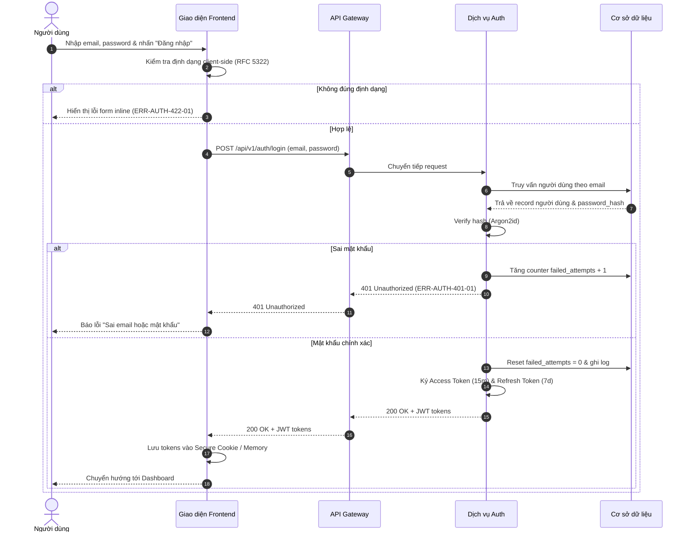

# Sơ đồ Tuần tự Tương tác Hệ thống (Sequence Diagram)

## Ngữ cảnh: Luồng Đăng nhập Email & Mật khẩu

```mermaid
sequenceDiagram
    autonumber
    actor User as Người dùng
    participant UI as Giao diện Frontend
    participant Gateway as API Gateway
    participant Auth as Dịch vụ Auth
    participant DB as Cơ sở dữ liệu

    User->>UI: Nhập email, password & nhấn "Đăng nhập"
    UI->>UI: Kiểm tra định dạng client-side (RFC 5322)
    alt Không đúng định dạng
        UI-->>User: Hiển thị lỗi form inline (ERR-AUTH-422-01)
    else Hợp lệ
        UI->>Gateway: POST /api/v1/auth/login (email, password)
        Gateway->>Auth: Chuyển tiếp request
        Auth->>DB: Truy vấn người dùng theo email
        DB-->>Auth: Trả về record người dùng & password_hash
        Auth->>Auth: Verify hash (Argon2id)
        alt Sai mật khẩu
            Auth->>DB: Tăng counter failed_attempts + 1
            Auth-->>Gateway: 401 Unauthorized (ERR-AUTH-401-01)
            Gateway-->>UI: 401 Unauthorized
            UI-->>User: Báo lỗi "Sai email hoặc mật khẩu"
        else Mật khẩu chính xác
            Auth->>DB: Reset failed_attempts = 0 & ghi log
            Auth->>Auth: Ký Access Token (15m) & Refresh Token (7d)
            Auth-->>Gateway: 200 OK + JWT tokens
            Gateway-->>UI: 200 OK + JWT tokens
            UI->>UI: Lưu tokens vào Secure Cookie / Memory
            UI-->>User: Chuyển hướng tới Dashboard
        end
    end
```
